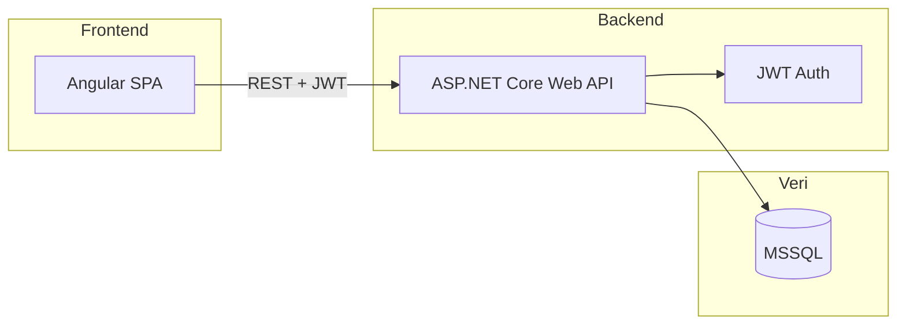

# Fatura Uygulaması — Mimari ve Uygulama Planı

## Genel Mimari

- **Backend:** ASP.NET Core 8 Web API, Entity Framework Core **Code First**, JWT kimlik doğrulama
- **Veritabanı:** SQL Server (LocalDB / Express); **Code First:** önce C# entity sınıfları yazılır, EF Core migration’ları ile şema oluşturulur/güncellenir
- **Frontend:** Angular 17+, standalone components, Angular Material veya PrimeNG
- **Güvenlik:** Kullanıcı sadece kendi faturalarını ve kendi müşterilerini görür; tüm sorgular `UserId` ile filtrelenir
- **Müşteri:** Müşteriler sisteme kaydedilir; fatura oluştururken hazır listeden seçilince alanlar otomatik dolar veya müşteri bilgileri manuel girilir

---

## 1. Veritabanı Tasarlama (MSSQL) — Code First

**Yaklaşım:** Veritabanı şeması **Code First** ile türetilir. Önce `User`, `Customer`, `Invoice`, `InvoiceItem` entity sınıfları (C#) ve `DbContext` içinde `DbSet` tanımları yazılır; ardından `Add-Migration` ve `Update-Database` ile MSSQL’de tablolar oluşturulur veya güncellenir. Şema değişiklikleri yine entity değişikliği + yeni migration ile yapılır.

**Tablolar (entity’lerden türetilecek):**

| Tablo                              | Amaç                                                                                                                                                                                                                                                                                                                                                                                                                               |
| ---------------------------------- | ---------------------------------------------------------------------------------------------------------------------------------------------------------------------------------------------------------------------------------------------------------------------------------------------------------------------------------------------------------------------------------------------------------------------------------- |
| **Users**                          | Giriş: Email, şifre hash, ad-soyad, rol (opsiyonel)                                                                                                                                                                                                                                                                                                                                                                                |
| **RefreshTokens**                  | Refresh token (UserId, Token, ExpiresAt, Revoked vb.) — JWT yenileme ve logout/revoke için                                                                                                                                                                                                                                                                                                                                         |
| **UserProfiles / CompanySettings** | Fatura kesen firma bilgisi: Firma adı, vergi dairesi, vergi no, adres, IBAN, logo URL; **UserId** (FK) — kullanıcı başına bir kayıt                                                                                                                                                                                                                                                                                                |
| **Customers**                      | Müşteri: Unvan, vergi no/TC, adres, telefon, e-posta, **UserId** (FK). **Soft delete:** `IsDeleted`, `DeletedAt`. **Audit:** `CreatedAt`, `CreatedBy`, `UpdatedAt`, `UpdatedBy`                                                                                                                                                                                                                                                    |
| **Invoices**                       | Fatura: **InvoiceNumber** (kullanıcı bazlı unique, örn. 2026-0001), tarih, **Status** (enum: Draft, Issued, Paid, Cancelled), **UserId** (FK), **CustomerId** (FK, nullable), müşteri snapshot alanları. **Tutarlar:** `SubTotal`, `TotalVat`, `GrandTotal` (backend hesaplar). **Para birimi:** `Currency`, `ExchangeRate`. **Audit:** `CreatedAt`, `CreatedBy`, `UpdatedAt`, `UpdatedBy`. **Concurrency:** `RowVersion` (byte[]) |
| **InvoiceItems**                   | Kalemler: Açıklama, **Quantity**, **UnitPrice**, **VatRate** (örn. 1, 8, 20), **LineTotalExclVat**, **LineVatAmount**, **LineTotalInclVat** (backend hesaplar), **InvoiceId** (FK)                                                                                                                                                                                                                                                 |

**Müşteri – Fatura ilişkisi:**

- **Customers:** Kullanıcıya bağlı (`UserId`). Müşteri ekleme/düzenleme/listeleme sadece o kullanıcının kayıtları üzerinden.
- **Invoices:** İki kullanım:
  - **Listeden seçim:** `CustomerId` dolu; fatura oluşturulurken müşteri bilgileri (unvan, vergi no, adres vb.) faturaya kopyalanır (snapshot). Böylece sonradan müşteri güncellense bile fatura değişmez.
  - **Manuel giriş:** `CustomerId` null; kullanıcı fatura formunda müşteri alanlarını elle doldurur, bu değerler doğrudan fatura kaydındaki müşteri alanlarına yazılır.
- Fatura kaydında hem `CustomerId` (opsiyonel) hem de müşteri bilgisi alanları (unvan, vergi no, adres vb.) tutulur; liste ve yazdırmada hep fatura kaydındaki bilgiler kullanılır.

**Fatura numarası:** Kullanıcı bazlı otomatik üretilir; format örn. `2026-0001`. Veritabanında **Unique index:** `(UserId, InvoiceNumber)`.

**Fatura durumu (state):** `InvoiceStatus` enum: `Draft`, `Issued`, `Paid`, `Cancelled`. **İş kuralları (business rules):** Paid fatura güncellenemez (update edilemez); Cancelled fatura hiçbir şekilde değiştirilemez (kalem ekleme/çıkarma/düzenleme yasak).

---

## 2. Backend (C# / ASP.NET Core)

**Klasör yapısı önerisi:**

- `hbt-fatura/src/Backend/` (veya `HbtFatura.Api/`)
  - **Models / Entities (Code First):** `User`, `Customer`, `Invoice`, `InvoiceItem` — POCO sınıfları, navigation property’ler ve gerekirse `[Required]`, `[MaxLength]` vb. data annotations veya Fluent API ile konfigürasyon
  - **DbContext:** `DbContext` türevi, `DbSet<User>`, `DbSet<Customer>`, `DbSet<Invoice>`, `DbSet<InvoiceItem>`; MSSQL connection string (appsettings); ilişkiler `OnModelCreating` içinde (Fluent API) tanımlanabilir
  - **Migration’lar:** Proje kökünde `Add-Migration InitialCreate` (ve sonrasında her şema değişikliğinde yeni migration); veritabanı `Update-Database` ile güncellenir
  - **DTOs:** Login/Register; Customer list/detail/create/update; Invoice list/detail/create/update (create/update’te `CustomerId` opsiyonel + müşteri alanları: unvan, vergi no, adres vb.)
  - **Repositories veya Services:** Kullanıcı, müşteri ve fatura işlemleri
  - **Services:** `AuthService`, `CustomerService`, `InvoiceService`; **InvoiceCalculationService** — fatura hesaplama **yalnızca backend’de** yapılır: satır bazında `Quantity × UnitPrice`, KDV, `LineTotalExclVat`, `LineVatAmount`, `LineTotalInclVat`; fatura bazında `SubTotal`, `TotalVat`, `GrandTotal`. **Frontend toplam göndermez** (sadece Quantity, UnitPrice, VatRate, Açıklama vb. ham alanları gönderir). Fatura + kalemler tek **transaction** (`BeginTransactionAsync`) ile kaydedilir.
  - **Validation:** FluentValidation ile DTO/command validasyonu; **business rules:** Paid invoice update edilemez, Cancelled invoice değiştirilemez (service katmanında kontrol).
  - **Mapping:** AutoMapper ile Entity ↔ DTO dönüşümleri.
  - **Controllers:**
    - `AuthController`: Register, Login (JWT + refresh token), RefreshToken, Logout/Revoke. **Rate limiting** ve **lockout** (brute force koruması) login endpoint’inde.
    - `CustomersController`: CRUD, listeleme (dropdown + sayfalama/filtre); soft delete kullanılır.
    - `InvoicesController`: CRUD, **sayfalama + filtre** (tarih aralığı, durum, müşteri); oluşturma/güncellemede hesaplama service’e bırakılır; **concurrency** (RowVersion) ile çakışma kontrolü.
    - `InvoicesController` veya ayrı endpoint: **PDF export** (fatura detayından PDF; DinkToPdf veya QuestPDF, HTML şablon → PDF).
  - **JWT:** Access token + refresh token; `AddAuthentication(JwtBearerDefaults.AuthenticationScheme)`, `[Authorize]`; token revoke için RefreshTokens tablosu.

**Önemli kurallar:**

- Müşteri listesi: `WHERE UserId = @CurrentUserId`
- Fatura listesi: `WHERE UserId = @CurrentUserId`
- Fatura ekleme: `UserId = currentUser.Id`; `CustomerId` varsa ilgili müşteriden snapshot al, yoksa DTO’daki müşteri alanlarını fatura kaydına yaz
- Güncelleme/silme: Müşteri ve fatura için sadece ilgili kayıt `UserId == currentUser.Id` ise izin ver

---

## 3. Frontend (Angular)

**Klasör yapısı önerisi:**

- `hbt-fatura/src/frontend/` (veya `hbt-fatura-ui/`)
  - **Auth:** Login / Register sayfaları, `AuthGuard`, `AuthService` (token saklama, HTTP interceptor)
  - **Customers:** Müşteri listesi, ekleme, düzenleme, silme (sadece kendi müşterileri); dropdown için API ile liste çekme
  - **Invoices:** Liste (sayfalama, tarih/durum/müşteri filtresi), detay, oluşturma/düzenleme (müşteri seçimi veya manuel). **Frontend toplam göndermez** — formda sadece kalemlerin Quantity, UnitPrice, VatRate, Açıklama gönderilir; SubTotal/TotalVat/GrandTotal ve satır toplamları **backend’den hesaplanıp döner** ve ekranda gösterilir. **PDF indir** butonu (API’den PDF alır)
  - **Company/Profil:** Firma bilgileri (fatura kesen taraf) ekleme/düzenleme ekranı
  - **Core:** HTTP interceptor (Authorization: Bearer token, refresh token rotation), base URL
  - **Shared:** ortak bileşenler (müşteri alanları form grubu, para birimi gösterimi), pipe’lar

**Fatura oluşturma/düzenleme formu (müşteri tarafı):**

- **Seçenek 1 — Listeden seç:** Dropdown/autocomplete ile kullanıcının müşteri listesi gösterilir. Müşteri seçilince fatura formundaki müşteri alanları (unvan, vergi no, adres, telefon vb.) otomatik doldurulur (API’den müşteri detayı veya listeden gelen bilgilerle). İstenirse kullanıcı bu alanları fatura için üzerinde değiştirebilir (sadece bu faturaya özel).
- **Seçenek 2 — Manuel doldur:** “Müşteri bilgilerini elle gir” gibi bir seçenek veya dropdown’da “Yeni / Manuel” seçimi; müşteri alanları boş bırakılır ve kullanıcı tüm müşteri bilgilerini manuel girer. Gönderimde `CustomerId` gönderilmez, sadece doldurulan müşteri alanları API’ye gider.
- Form gönderilirken: Seçilen müşteri varsa `CustomerId` + (gerekirse güncellenmiş) müşteri alanları; manuel ise sadece müşteri alanları gönderilir.

**Akış:**

- Giriş yapmamış kullanıcı sadece Login/Register görür; diğer rotalar `AuthGuard` ile korunur.
- Giriş sonrası token saklanır; her istekte header’a eklenir.
- Müşteri ve fatura listesi/CRUD için backend’e istek atılır; backend kullanıcı bazlı filtreyi uygular.

---

## 4. Uygulama Sırası (Önerilen)

1. **Solution ve projeler:** Backend API projesi + Angular projesi oluşturma
2. **EF Core Code First:** Entity sınıfları (`User`, `Customer`, `Invoice`, `InvoiceItem`) ve `DbContext` yazılır; connection string (appsettings); ilk migration (`Add-Migration InitialCreate`) oluşturulur, `Update-Database` ile MSSQL’de tablolar oluşturulur (Invoice’ta müşteri snapshot alanları + opsiyonel `CustomerId`)
3. **Auth backend:** Register, Login (JWT + refresh token), RefreshToken, Logout/Revoke; rate limiting ve lockout
4. **CompanySettings API:** Firma bilgileri CRUD (UserId bazlı)
5. **Customers API:** CRUD, sayfalama/filtre, soft delete, audit; dropdown listesi
6. **Invoices API:** CRUD, sayfalama + filtre (tarih, durum, müşteri); InvoiceCalculationService (KDV/toplam); transaction; RowVersion; fatura no otomatik; durum kuralları
7. **PDF export:** Fatura detayından PDF endpoint (DinkToPdf / QuestPDF)
8. **Angular projesi:** Routing, Auth (login/register, refresh, guard, interceptor), API service
9. **Müşteri UI:** Liste (sayfalama/filtre), ekleme/düzenleme, soft delete
10. **Firma ayarları UI:** Firma bilgileri ekranı
11. **Fatura UI:** Liste (sayfalama, filtre), detay, oluşturma/düzenleme, müşteri seçimi veya manuel, frontend toplam göndermez, toplamlar backend'den gelir; PDF indir, durum geçişleri’ı  “Manuel gir”
12. **Test ve ince ayar:** KDV hesaplama, sayfalama/filtre, refresh token, PDF, concurrency senaryoları

---

## 5. Teknoloji Özeti

- **Backend:** .NET 8, EF Core 8 **Code First** (entity + DbContext + migrations), Microsoft.AspNetCore.Authentication.JwtBearer, SQL Server provider
- **Frontend:** Angular 17+, HttpClient, Router, Reactive Forms; UI için Angular Material veya PrimeNG
- **Veritabanı:** SQL Server (geliştirme: LocalDB veya SQL Express)
- **Kimlik doğrulama:** JWT access + refresh token; refresh token tablosu, logout/revoke; login'de rate limiting / lockout
- **PDF:** DinkToPdf veya QuestPDF (HTML şablon → PDF)
- **Mapping / Validation:** AutoMapper, FluentValidation

---

## 6. Detaylar ve Ek Gereksinimler (Özet)

**Fatura hesaplama (backend, frontend toplam göndermez):** Tüm tutar hesaplamaları **backend’de** yapılır. Frontend sadece ham alanları gönderir (Quantity, UnitPrice, VatRate, Açıklama). Backend: satır için `Quantity × UnitPrice`, KDV hesaplar, `LineTotalExclVat`, `LineVatAmount`, `LineTotalInclVat`; fatura için `SubTotal`, `TotalVat`, `GrandTotal` hesaplar ve kaydeder. Bu, güvenilir ve tek kaynak (single source of truth) prensibine uygundur.

**InvoiceStatus enum ve business rules:** `Draft`, `Issued`, `Paid`, `Cancelled`. **Paid** fatura **update edilemez**. **Cancelled** fatura **hiçbir şekilde değiştirilemez** (kalem ekleme/çıkarma/düzenleme yasak). Bu kurallar service katmanında uygulanır.

**Vergi (KDV):** InvoiceItem'da `Quantity`, `UnitPrice`, `VatRate`, `LineTotalExclVat`, `LineVatAmount`, `LineTotalInclVat`; Invoice'da `SubTotal`, `TotalVat`, `GrandTotal`. Tüm hesaplar **backend** (InvoiceCalculationService) yapar.

**Fatura numarası:** Kullanıcı bazlı otomatik (örn. 2026-0001); DB'de `Unique(UserId, InvoiceNumber)`.

**Fatura durumu:** Enum `Draft`, `Issued`, `Paid`, `Cancelled`. Business rule: Paid update edilemez; Cancelled değiştirilemez.

**Soft delete:** Customers için `IsDeleted`, `DeletedAt`; faturalar silinmez, Cancelled yapılır.

**Audit:** Invoice ve Customer için `CreatedAt`, `CreatedBy`, `UpdatedAt`, `UpdatedBy`.

**Pagination ve filtre:** Fatura listesi sayfalama; tarih aralığı, durum, müşteri filtresi. Müşteri listesinde de sayfalama/filtre.

**Concurrency:** Invoice'da `RowVersion` (byte[]); EF Core ile aynı faturayı iki kullanıcı düzenlerse çakışma tespiti.

**Refresh token:** Tablo + endpoint; access token süresi kısa, yenileme ile uzatma; logout'ta revoke.

**Rate limiting / Lockout:** Login endpoint'inde başarısız deneme sınırı ve geçici kilitleme.

**PDF çıktı:** Fatura detayından PDF export endpoint; HTML şablon → PDF (DinkToPdf / QuestPDF).

**Para birimi:** Invoice'da `Currency`, `ExchangeRate`; tek veya çoklu para birimi desteği.

**Firma bilgisi:** UserProfile / CompanySettings tablosu; firma adı, vergi dairesi, IBAN, logo (URL); fatura başlığında kullanılır.

**Service katmanı + validation:** FluentValidation, business rule katmanı, InvoiceCalculationService; Invoice + Items tek transaction ile yazılır.

**AutoMapper:** DTO ↔ Entity mapping merkezi.

Bu plan ile önce backend ve veritabanı, sonra auth, ardından fatura API’si, en sonda Angular tarafı adım adım ilerletilebilir. İstersen bir sonraki adımda backend için solution/proje yapısı veya Angular için modül/route listesini tek tek çıkarabilirim.